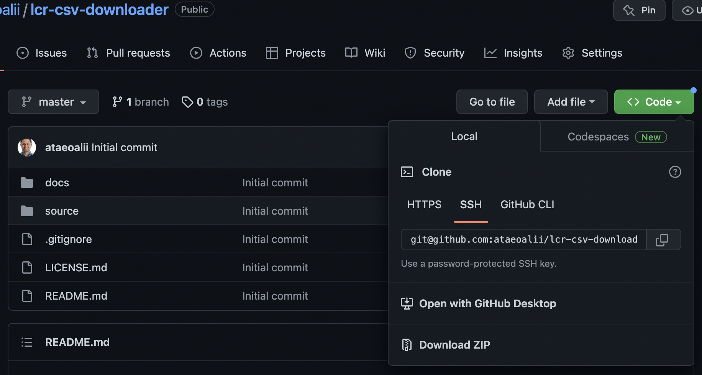
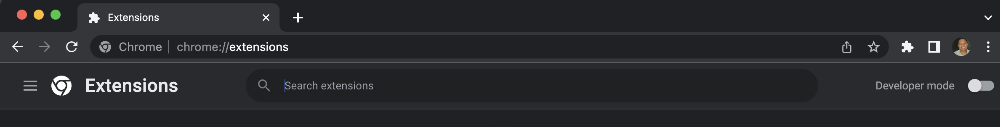
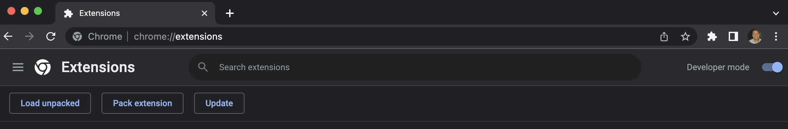
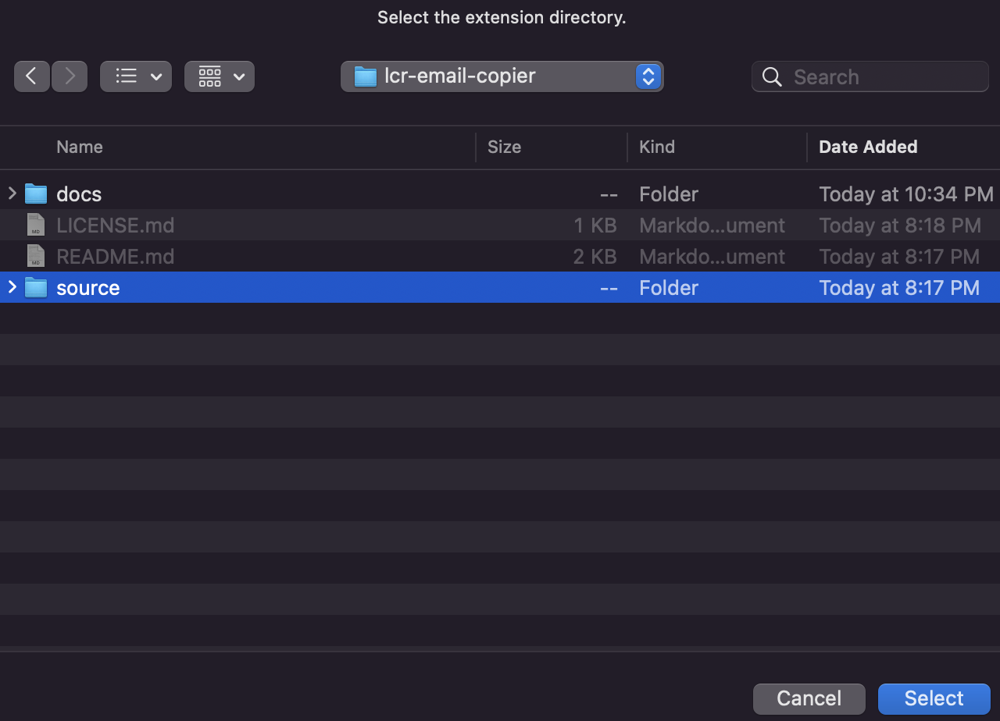
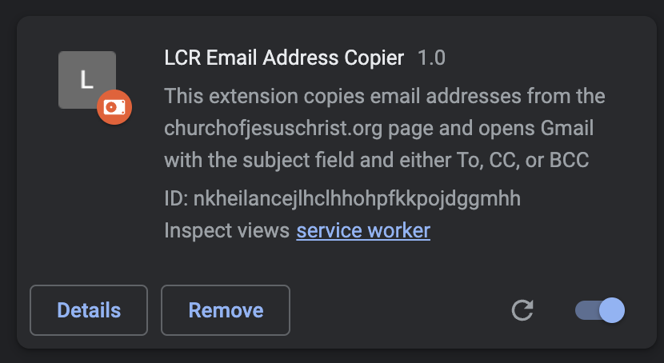
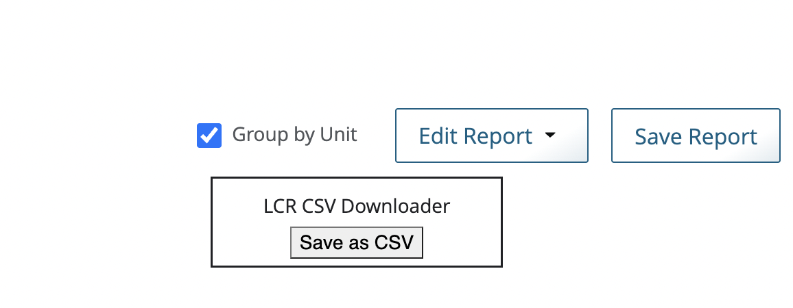

# LCR CSV Downloader

The current LCR functionality to generate reports only creates PDFs, but doesn't allow to export as
a CSV file on
[The Church of Jesus Christ of Latter-day Saints](https://lcr.churchofjesuschrist.org/report)
website. This chrome extension adds a button to download the custom report as a CSV file which
can be opened with google sheets or excel.

NOTE: This extension is not in any way affiliated or developed by the church.

# Installation

1. Scroll to the top of this page, click the green Code button and then "Download ZIP". After downloading, unzip it on your computer.

2. Go to [chrome://extensions](chrome://extensions) in your chrome browser.

3. Enable developer mode (on the right side). After doing this, you'll see 3 additional buttons ("Load Unpacked", "Pack extension", and "Update").

1. Click "Load Unpacked" and select the "source" folder from the unzipped lcr-csv-downloader folder on your computer.

5. Ensure that the LCR CSV Downloader extension is enabled with the slider slid to the right.

Congratulations 🎉! The extension is now installed and can be used whenever you are trying to
[send a message](https://lcr.churchofjesuschrist.org/messaging) on the church website.

# Usage

1. Go to the [Create a Report](https://lcr.churchofjesuschrist.org/report/custom-reports) application on LCR.
2. Select the report you want.
3. A button will appear on the right side that says **Save as CSV**. Upon clicking that button one or more
   reports will be downloaded.

NOTE: This tool was only created for the LCR "Create a Report" function and will only display the
an additional button on that page. If the church updates the website and this no longer works, please
file an issue to fix the extension.

# Troubleshooting

1. If the button doesn't load the first time, just try refreshing the page.
